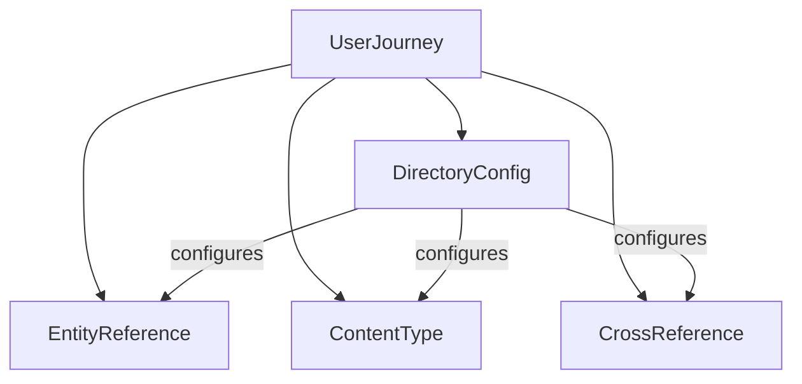

# UserJourney Plugin
{: .no_toc }

The UserJourney plugin orchestrates multi-module document processing workflows for technical writers. Unlike other ADT plugins that process content directly, UserJourney **coordinates other plugins** to create comprehensive, stateful workflows.

{: .highlight }
**What it does**: Manages persistent workflows that guide you through multi-step document processing, handling module dependencies, progress tracking, and interruption recovery.

{: .important }
**Why it matters**: Large documentation projects require multiple ADT modules to work together. UserJourney ensures proper sequencing, tracks progress, and lets you resume work after interruptions.

## Table of contents
{: .no_toc .text-delta }

1. TOC
{:toc}

## Quick Start

### Basic Workflow

```bash
# 1. Start a new workflow
adt journey start --name "my-project" --directory "/path/to/docs"

# 2. Check status
adt journey status --name "my-project"

# 3. Execute next module
adt journey continue --name "my-project"

# 4. List all workflows
adt journey list
```

### What Happens Behind the Scenes

1. **Module Discovery**: UserJourney discovers all available ADT modules
2. **Dependency Resolution**: Determines optimal execution order (DirectoryConfig → EntityReference → ContentType, etc.)
3. **File Discovery**: Finds all `.adoc` files in your directory
4. **State Management**: Creates persistent workflow state that survives interruptions
5. **Guided Execution**: Walks you through each module with clear progress indicators

## Core Concepts

### Workflows

A **workflow** is a named, persistent process that tracks:
- Which modules need to run
- Current progress and completion status
- Files discovered and processed
- Execution results and any errors
- Directory configuration settings

Workflows are stored in `~/.adt/workflows/` and survive system restarts.

### Module Orchestration

UserJourney doesn't process content itself—it **orchestrates other ADT modules**:



### State Persistence

Every operation is saved to disk with atomic writes and backup recovery:
- **Atomic saves**: Temp file → backup → rename pattern
- **Corruption recovery**: Automatic backup restoration
- **State migration**: Handles format upgrades seamlessly

## Commands Reference

### `adt journey start`

Create and initialize a new workflow.

```bash
adt journey start --name <workflow-name> --directory <path>
```

**Options**:
- `--name, -n`: Unique identifier for the workflow
- `--directory, -d`: Root directory containing `.adoc` files

**Example**:
```bash
adt journey start --name "user-guide-update" --directory "./docs"
```

**What it does**:
1. Validates the target directory exists and contains `.adoc` files
2. Discovers available ADT modules and resolves dependencies
3. Creates initial workflow state with all modules marked as "pending"
4. Provides next steps for continuing the workflow

### `adt journey status`

Display detailed workflow progress and current state.

```bash
adt journey status --name <workflow-name>
```

**Example Output**:
```
==================================================
Workflow: user-guide-update
Directory: ./docs
Created: 2025-07-20 14:30:15
Last Activity: 2025-07-20 14:45:22
==================================================

Progress Overview:
  Total Modules:     4
  Completed:         2
  Failed:            0
  Pending:           2
  Overall Progress:  50.0%

File Statistics:
  Total Files:       45
  Processed Files:   28

Current Module:      ContentType

Module Details:
  ✅ DirectoryConfig  COMPLETED (2.3s, 45 files)
  ✅ EntityReference  COMPLETED (5.1s, 28 files) 
  🔄 ContentType      RUNNING   (started 2 min ago)
  ⏸️ CrossReference   PENDING
```

### `adt journey continue`

Execute the next pending module in the workflow.

```bash
adt journey continue --name <workflow-name>
```

**What it does**:
1. Identifies the next module to run based on dependencies
2. Executes the module with full context (discovered files, directory config, etc.)
3. Updates workflow state with results
4. Provides feedback and suggests next steps

**Special handling**:
- **DirectoryConfig**: Interactive module that may prompt for input
- **Failed modules**: Shows retry count and error details
- **Completed workflows**: Gracefully handles "nothing to do" cases

### `adt journey list`

Display all available workflows with summary information.

```bash
adt journey list
```

**Example Output**:
```
ℹ️  Found 3 workflow(s):

  ✅ documentation-audit   COMPLETED
     Directory: /home/user/projects/docs
     Progress:  4/4 modules (100.0%)
     Files:     156/156
     Modified:  2025-07-19 16:22:10

  🔄 user-guide-update     ACTIVE
     Directory: ./docs
     Progress:  2/4 modules (50.0%)
     Files:     28/45
     Modified:  2025-07-20 14:45:22

  ❌ legacy-migration       FAILED
     Directory: /archive/old-docs
     Progress:  1/4 modules (25.0%)
     Files:     0/203
     Modified:  2025-07-18 09:15:33
```

### `adt journey resume`

Resume a previously created workflow (alias for `continue`).

```bash
adt journey resume --name <workflow-name>
```

This is functionally identical to `continue` but provides clearer semantics when restarting work after a break.

### `adt journey cleanup`

Remove old or unwanted workflows.

```bash
# Remove specific workflow
adt journey cleanup --name <workflow-name>

# Remove all completed workflows
adt journey cleanup --completed

# Remove failed workflows older than 7 days
adt journey cleanup --failed --older-than 7d
```

**Safety features**:
- Always prompts for confirmation before deletion
- Shows what will be deleted before proceeding
- Cannot accidentally delete active workflows

## Advanced Usage

### Handling Interruptions

UserJourney is designed to handle interruptions gracefully:

```bash
# Start a workflow
adt journey start --name "big-project" --directory "./massive-docs"

# Let it run... press Ctrl+C to interrupt
^C
Workflow interrupted. State saved automatically.

# Resume later
adt journey continue --name "big-project"
```

The workflow state is saved after every module completion, so you never lose progress.

### Working with DirectoryConfig

The DirectoryConfig module runs first and may be interactive:

```bash
adt journey continue --name "my-workflow"
```

```
🔄 Executing DirectoryConfig...
⚠️  DirectoryConfig is interactive and may prompt for input

Found the following directories:
  • ./chapters/ (23 .adoc files)
  • ./tutorials/ (12 .adoc files)  
  • ./reference/ (8 .adoc files)

Include all directories? [Y/n]: y

✅ DirectoryConfig completed successfully
📁 Discovered 43 .adoc files across 3 directories
```

### Error Recovery

When modules fail, UserJourney provides detailed error information and recovery options:

```
❌ ContentType module failed (attempt 2/3)
Error: Permission denied writing to ./docs/restricted.adoc

Suggestions:
  • Check file permissions: ls -la ./docs/restricted.adoc
  • Run with elevated permissions if needed
  • Use --skip-current to continue without this module
  • Use --verbose for detailed error output

Next steps:
  adt journey continue --name="my-workflow"  # Retry
  adt journey continue --name="my-workflow" --skip-current  # Skip
```

### Performance Considerations

UserJourney is optimized for large documentation sets:

- **Workflow creation**: < 1 second for typical projects
- **Status display**: < 0.5 seconds even with complex workflows  
- **State persistence**: < 0.1 seconds for atomic saves
- **Memory efficient**: Processes files in batches, not all at once

## Troubleshooting

### Common Issues

#### "Workflow not found"
```bash
adt journey status --name "typo-in-name"
# Error: Workflow 'typo-in-name' not found
```

**Solution**: Use `adt journey list` to see available workflows.

#### "Directory contains no .adoc files"
```bash
adt journey start --name "empty" --directory "/tmp/empty"
# Error: Directory contains no .adoc files to process
```

**Solution**: Verify your directory path and ensure it contains `.adoc` files.

#### "Module execution failed repeatedly"
```bash
# Module fails 3 times in a row
```

**Solutions**:
- Use `--verbose` flag for detailed error output
- Check file permissions and disk space
- Use `--skip-current` to bypass problematic modules
- Review module-specific documentation for troubleshooting

### State File Corruption

If workflow state becomes corrupted:

```bash
# UserJourney will attempt automatic recovery
adt journey status --name "corrupted-workflow"
# Warning: State file corrupted, attempting recovery...
# ✅ Recovery successful, some progress data may be lost
```

If automatic recovery fails, you can start a new workflow with the same directory.

### Debug Information

For detailed debugging:

```bash
# Enable verbose output
adt journey continue --name "debug-me" --verbose

# Check workflow storage location
ls -la ~/.adt/workflows/

# Examine state file directly (JSON format)
cat ~/.adt/workflows/my-workflow.json
```

## Best Practices

### Workflow Naming

Use descriptive names that indicate the project and purpose:

```bash
# Good
adt journey start --name "user-guide-v2.1-migration" --directory "./docs"
adt journey start --name "api-docs-dita-prep" --directory "./api-reference"

# Less clear
adt journey start --name "test" --directory "./docs"
adt journey start --name "workflow1" --directory "./stuff"
```

### Directory Organization

Organize your documentation before starting workflows:

```
project/
├── docs/
│   ├── user-guide/     ← Good: organized structure
│   │   ├── getting-started.adoc
│   │   └── advanced.adoc
│   ├── api/
│   │   └── reference.adoc
│   └── tutorials/
│       └── basics.adoc
└── mixed-content/      ← Avoid: mixed file types
    ├── doc1.adoc
    ├── image.png
    └── script.py
```

### Progress Monitoring

Check status regularly for long-running workflows:

```bash
# Quick status check
adt journey list

# Detailed progress for specific workflow
adt journey status --name "long-running-project"

# Continue processing
adt journey continue --name "long-running-project"
```

### Cleanup Maintenance

Regularly clean up old workflows:

```bash
# Monthly cleanup of completed workflows
adt journey cleanup --completed

# Remove failed workflows older than a week
adt journey cleanup --failed --older-than 7d
```

## Integration with Other Tools

### Version Control

UserJourney works well with version control systems:

```bash
# Create feature branch for documentation updates
git checkout -b docs/dita-migration

# Run workflow
adt journey start --name "dita-migration" --directory "./docs"
adt journey continue --name "dita-migration"  # repeat until complete

# Review changes
git diff

# Commit results
git add .
git commit -m "Apply DITA migration workflow"
```

### CI/CD Integration

Use UserJourney in automated environments:

```bash
#!/bin/bash
# CI script example

# Start workflow
adt journey start --name "ci-validation" --directory "./docs"

# Run all modules
while adt journey continue --name "ci-validation"; do
    echo "Module completed, continuing..."
done

# Check final status
adt journey status --name "ci-validation"
```

### IDE Integration

Many editors support external tools integration:

- **VS Code**: Add as custom task in `tasks.json`
- **IntelliJ**: Configure as external tool
- **Vim/Emacs**: Create custom commands

## Related Documentation

- [DirectoryConfig Plugin](DirectoryConfig.html) - First module in every workflow
- [EntityReference Plugin](EntityReference.html) - HTML entity conversion
- [ContentType Plugin](ContentType.html) - Content type attribute management
- [CrossReference Plugin](CrossReference.html) - Cross-reference validation

## Support

For issues, feature requests, or questions:

- **GitHub Issues**: [asciidoc-dita-toolkit/issues](https://github.com/rolfedh/asciidoc-dita-toolkit/issues)
- **Documentation**: [Project Documentation](https://github.com/rolfedh/asciidoc-dita-toolkit/blob/main/docs/)

## What's Next?

UserJourney is designed for extensibility. Future enhancements may include:

- **Phase 2**: Git integration (automatic branching, pull requests)
- **Phase 3**: Interactive module resolution and conflict handling  
- **Phase 4**: Workflow templates and team collaboration features

The current MVP provides a solid foundation for orchestrating multi-module document processing workflows with enterprise-grade reliability and user experience.
